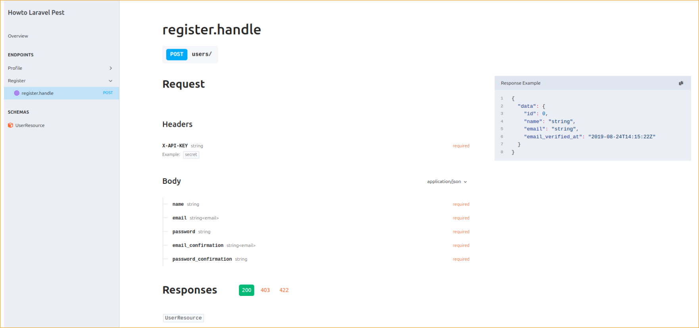

# Laravel 11.x API Template

## Introduction

This repository serves as a template to kickstart a Laravel 11.x project.

## Screenshots


## Key Features

The template comes with the following pre-built API endpoints:

1. **User Registration** - Allows creating a new user account.

2. **Fetch Authenticated User Details** - Retrieves the profile information of the currently logged-in user.

3. **User Login** - Logs in using email and password, and returns an `access_token` and `refresh_token`.

4. **Token Refresh** - Refreshes the `access_token` using a `refresh_token`.

## OpenAPI Documentation

The template includes pre-configured OpenAPI documentation powered by the **Scramble** library.

### Accessing API Documentation

1. Start the Laravel project.

2. Open your browser and navigate to: `http://localhost:8080/docs/api/`.

## Installation and Setup

Follow these steps to install and run the project:

1. Clone the repository:

```shell
    git clone <repository-url>
```

```shell
    cd <project-folder>
```

2. Install dependencies:

```shell
    composer install
```

3. Create the environment configuration file:

```shell
    cp .env.example .env
```

4. Generate the application key:

```shell
    php artisan key:generate
```

5. Configure the database and run migrations:

```shell
    php artisan migrate
```

6. Start the development server:

```shell
    php artisan serve
```

## License

This project is licensed under the MIT License.
